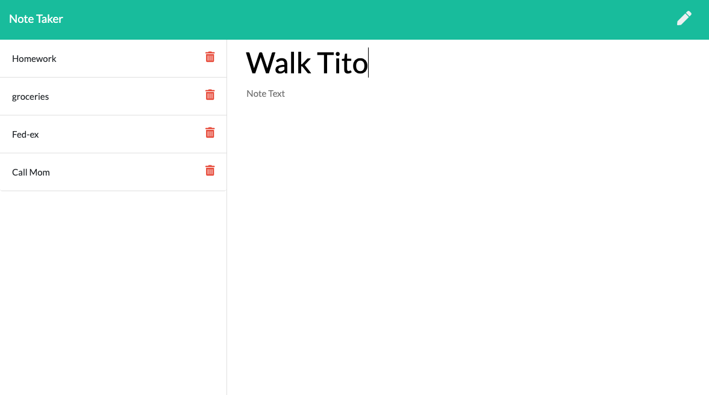

# Note-Taker

Note-Taker is a simple application that allows the user to create, view and delete
notes. This was my first application using routes witht the express framework.

## Node.js, Bootstrap, Express

## Deployed URL [Note-Taker](https://afternoon-inlet-12328.herokuapp.com/)

## Author

* **Jordan McQuiston** 